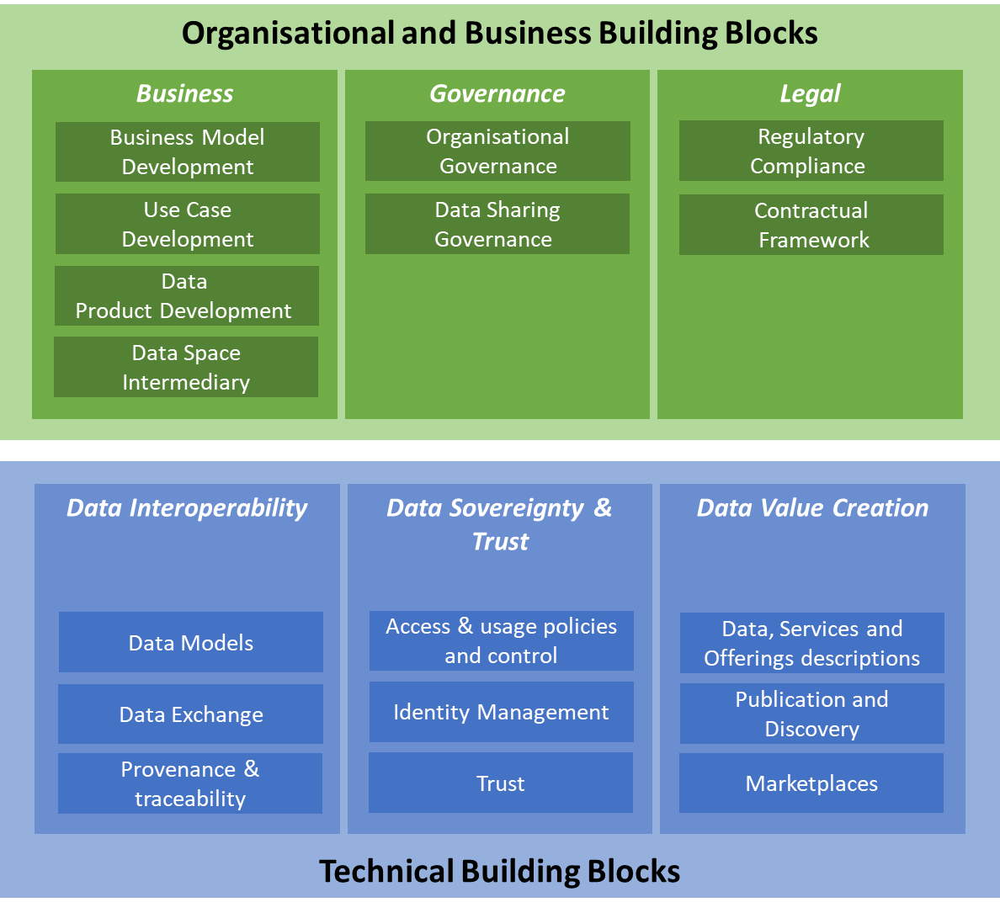

# Documentation structure

This documentation is mainly structured based on the [building blocks as defined by Data Spaces Support Centre](https://dssc.eu/space/BBE/178421909/Organisational+and+Business+building+blocks).

<figure><figcaption>
Overview of DSSC Building Blocks
</figcaption></figure>


Of course data spaces are allowed to publish agreements on other topics then the topics above. iSHARE already provides one extra topic:

* Operational agreements on service levels

