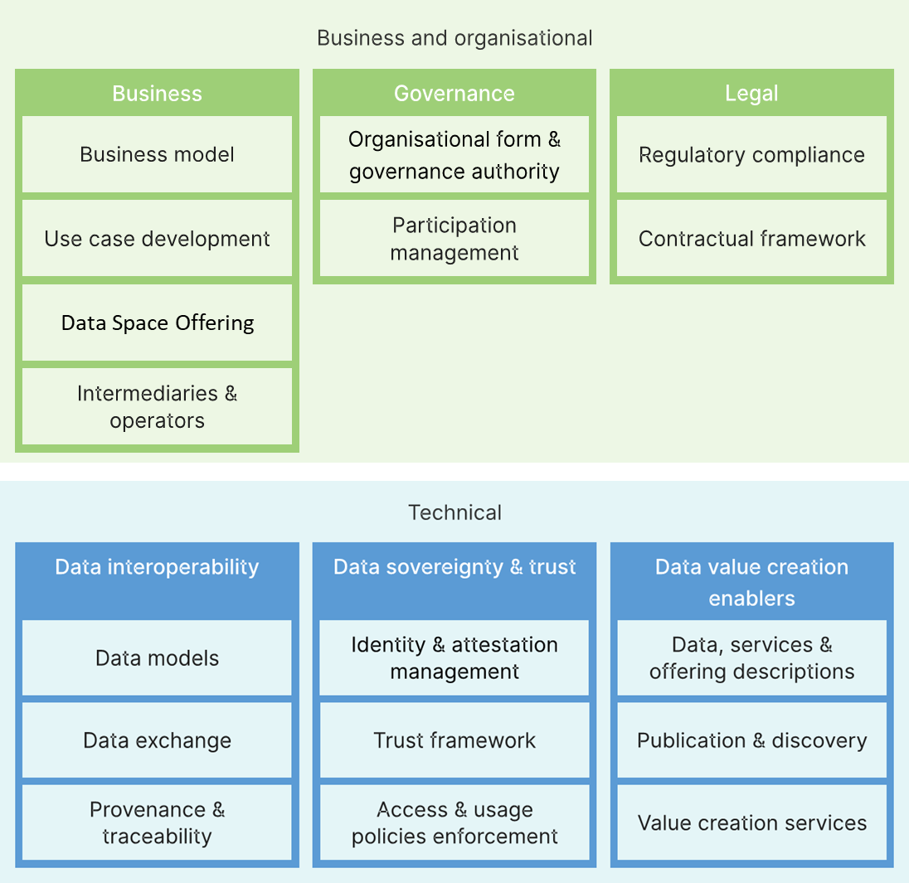

# Documentation structure

This documentation is mainly structured based on the [building blocks as defined in the Data Spaces Blueprint 2.0 by Data Spaces Support Centre](https://dssc.eu/space/BVE2/1071251457/Data+Spaces+Blueprint+v2.0+-+Home), which are based on the [Open DEI project](https://design-principles-for-data-spaces.org/).

<figure><figcaption>
Overview of DSSC Data Spaces Blueprint v2.0 Building Blocks
</figcaption></figure>


Data spaces are allowed to publish agreements on other topics then the topics above. iSHARE provides the following extra topics, which are also covered in this data space framework:

* [Operational processes](operational/operational-processes.md)
* [Glossary](glossary.md)

